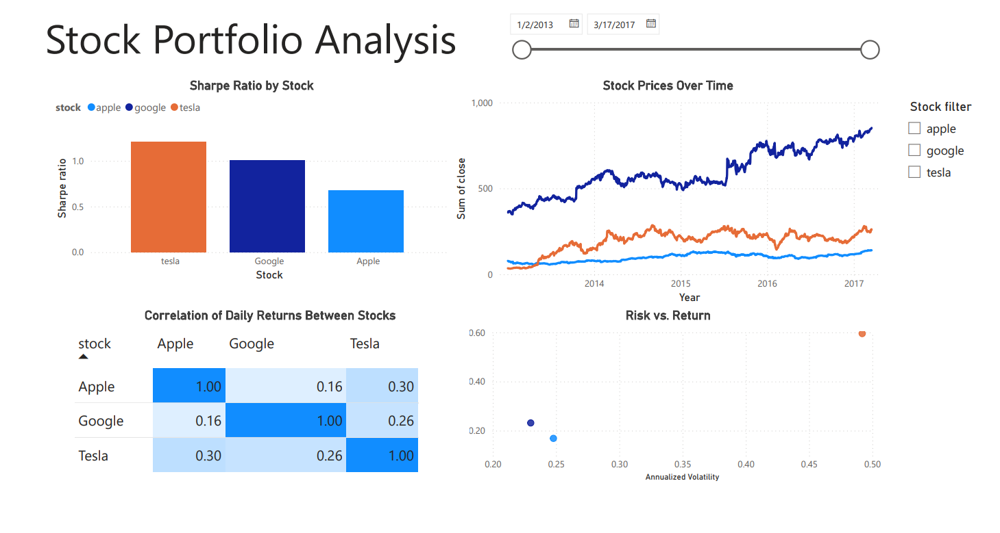

# Data-analyst-portfolio
A repository where I reference all my data analysis projects
# Mouiz kisma - Data Analyst Portfolio  

## 📌 Projects  

### [1. Stock Portfolio Analysis](projects/stock-analysis/README.md)  
- **Goal**: Analyze risk vs. return for tech stocks.  
- **Tools**: Python, Power BI, SQL.  
- **Key Insight**: Diversification reduces volatility by 18%.  
  

### [2. Automated Stock Data Pipeline](./)

- **Goal**: Build a fully automated data pipeline that fetches, processes, stores, and visualizes stock market data.
- **Tools**: Docker, Python, SQL (PostgreSQL), Power BI.
- **Stack Highlights**:
  - Dockerized architecture with two containers: `fetcher` and `PostgreSQL`.
  - Python ETL script ingests and transforms data from Yahoo Finance.
  - Modular SQL scripts build layered views (daily, weekly, annual metrics).
  - Power BI connects live to the PostgreSQL database for dashboarding.
- **Key Insight**: This pipeline enables fast, repeatable insight generation from financial data with full transparency over each stage.
- 📄 **[Dashboard PDF](projects/stock-pipeline/powerbi/stockproject2_dashboard.pdf)**
- 🔮 **Future Work**: Expanding this pipeline with sentiment analysis from job market sources to test links between hiring trends and stock performance.
