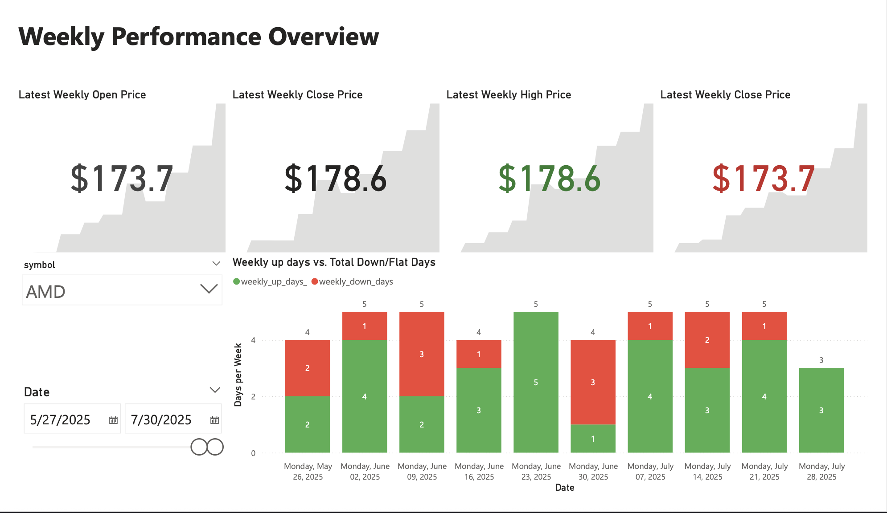

# Data-analyst-portfolio
A repository where I reference all my data analysis projects
# Mouiz kisma - Data Analyst Portfolio  

## 📌 Projects

[1. IMS Bearing Failure Prediction Analysis using feature engineering](<projects/Predictive project/README.md>)\
[2. Cyclistic Membership Conversion Report](<projects/Google Data case study/README.md>)\
[3. Automated Stock Data Pipeline](projects/stock-pipeline/README.md)\
[4. Stock Portfolio Analysis](projects/stock-analysis/README.md) 
##
### [1. IMS Bearing Failure Prediction Analysis using feature engineering](<projects/Predictive project/README.md>)
**Goal:** Develop failure prediction models for industrial bearings using sensor data analysis to reduce unplanned downtime.  
**Tools:** Python (Pandas, Scikit-learn, XGBoost), Kaggle Notebooks.  
**Stack Highlights:**  
- Processed 984 vibration sensor files from IMS bearing dataset with 20kHz sampling rate.
- Engineered 5 features from raw vibration signals: RMS, kurtosis, crest factor, spectral entropy, dominant frequency.
- Trained Random Forest and XGBoost models - XGBoost performed better on 5-feature comparison.
- Retrained XGBoost on 3 overlapping features (RMS, kurtosis, crest factor) for CWRU dataset compatibility.
- Achieved 44.2% accuracy and 91.5% precision when testing on external CWRU bearing dataset.  
**Key Insight:** Cross-dataset validation revealed significant generalization challenges, with high precision but limited recall when applying IMS-trained model to CWRU data.

- 
- 
### [2. Cyclistic Membership Conversion Report](<projects/Google Data case study/README.md>)  
**Goal:** Analyze ride patterns to identify strategies for converting casual bike-share riders into annual members.  
**Tools:** Python (Pandas), SQL, Power BI.  
**Stack Highlights:**  
- Cleaned and transformed 12 months of ride data (~5M rows) with calculated fields for ride duration, day of week, and hour of day.  
- Compared member vs. casual usage patterns by time, location, and seasonality.  
- Designed KPI tiles and visualizations (hourly, monthly, and membership mix) in Power BI.  

**Key Insight:** Casual riders often commute in the evening, presenting a prime target for a commute-focused membership offer.

**Dashboard Preview:**  
-   
- **[Dashboard PDF](<projects/Google Data case study/Final_dashboard/Cyclistic Member vs Casual Riders Dashboard.pdf>)**

### [3. Automated Stock Data Pipeline](projects/stock-pipeline/README.md)

- **Goal**: Build a fully automated data pipeline that fetches, processes, stores, and visualizes stock market data.
- **Tools**: Docker, Python, SQL (PostgreSQL), Power BI.
- **Stack Highlights**:
  - Dockerized architecture with two containers: `fetcher` and `PostgreSQL`.
  - Python ETL script ingests and transforms data from Yahoo Finance.
  - Modular SQL scripts build layered views (daily, weekly, annual metrics).
  - Power BI connects live to the PostgreSQL database for dashboarding.
- **Key Insight**: This pipeline enables fast, repeatable insight generation from financial data with full transparency over each stage.
-  
-  
-  
- **[Dashboard PDF](projects/stock-pipeline/powerbi/stock_pipeline_dashboard.pdf)**
- **Future Work**: Expanding this pipeline with sentiment analysis from job market sources to test links between hiring trends and stock performance.

### [4. Stock Portfolio Analysis](projects/stock-analysis/README.md)  
- **Goal**: Analyze risk vs. return for tech stocks.  
- **Tools**: Python, Power BI, SQL.  
- **Key Insight**: Diversification reduces volatility by 18%.  
 

