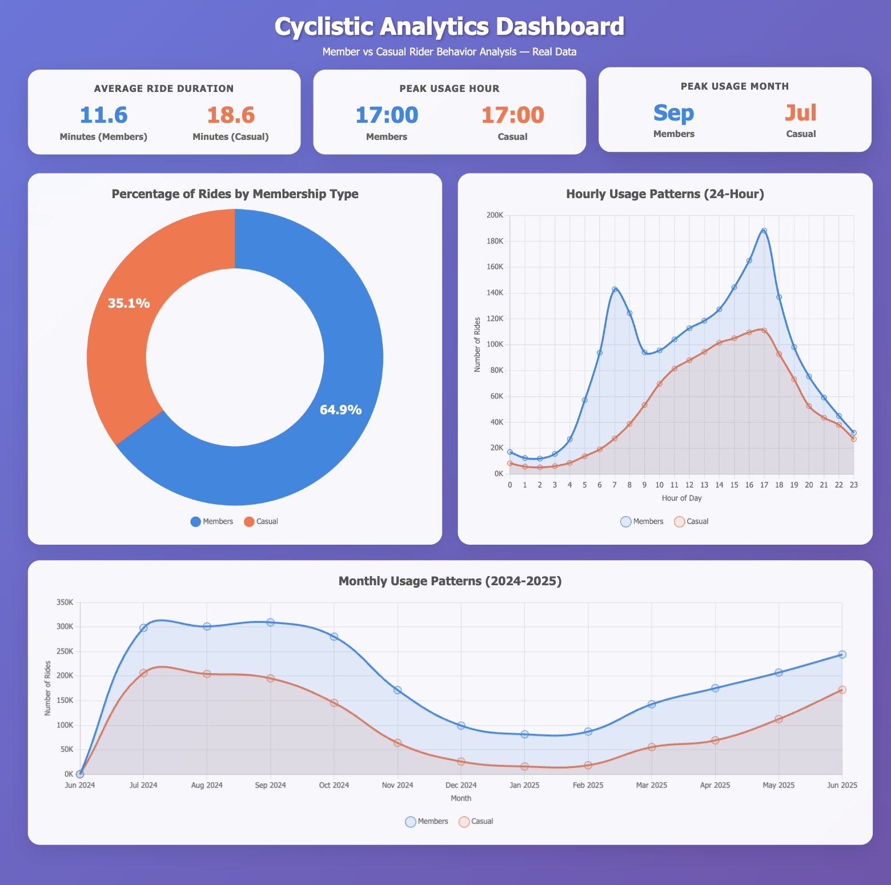

# Cyclistic Membership Conversion Report

## 1) Business Task
Increase annual memberships to secure steadier revenue by understanding how casual riders and annual members use the bike-share system differently, then translating those differences into actions to convert casuals into members.

---

## 2) Data Sources
**Provider:** Motivate International Inc. (Cyclistic historical ride data; Cyclistic is a fictional company used for analysis practice).

- **Window analyzed:** July 2024 – June 2025 (12 months)  
- **Format:** Monthly CSV files (~300k–800k rows each)  
- **Schema (per file):**  
  `ride_id`, `rideable_type`, `started_at`, `ended_at`, `start_station_name/id`, `end_station_name/id`, `member_casual`  
- **Known limitations:**  
  - Missing station names in some records  
  - No demographic data (age, gender, etc.)  
  - Data reflects rider behavior only (no marketing exposure data)

---

## 3) Processing & Cleaning
**Integrity checks:**  
- Reviewed duplicates, missing values, and outliers  
- Noted missing station fields

**Transformations created:**  
- `ride_duration` (calculated from start/end timestamps)  
  - Validity filter: keep rides between **1.5 minutes and 2 hours**  
- `day_of_week` extracted from date  
- `hour_of_day` extracted from start time  

**Exclusions:**  
- Removed test, maintenance, and incomplete records  

**Outcome:**  
Dataset ready for **member-vs-casual comparison** across time granularities, locations, and equipment.

---

## 4) Summary of Analysis
- **Membership mix:** Members had more rides than casual riders over the analyzed year  
- **Ride duration:** Casual riders’ average ride time is higher than members’ despite fewer total rides  
- **Daily usage patterns:**  
  - Members peak at **morning and evening commute times**  
  - Casual riders peak in the **evening rush hour** with less morning usage  
- **Seasonality:**  
  - Monthly patterns are similar for both segments → same seasonal curve, suggesting shared environmental/seasonal factors  
- **Interpretation:**  
  - Members behave like **routine commuters**  
  - Casual riders lean toward **discretionary/after-work trips**, but some clearly commute in the evening

---

## 5) Supporting visualizations

**KPI Tiles:**
- Total rides (by member type)  
- Average ride duration (by member type)  
- Peak usage month (by member type)  

**Charts:**
- **Hybrid bar chart + labels:** Total rides by member type (acts as KPI + chart)  
- **Donut chart:** % of rides by membership type (no center text, clean hollow)  
- **Hourly usage line chart:** Emphasize peak hours for both casual and members; include a Peak Hour KPI for each segment  
- **Monthly usage line chart:** Side-by-side trends to show identical seasonality  

**Accessibility:**  
- High-contrast palettes  
- Readable axis labels  
- Descriptive alt text/titles  
- Single-page layout with clear visual hierarchy

---

## 6) Top Three Recommendations

### 1. Convert Evening Commuters Among Casual Riders
**Why:** Evening rush-hour peak suggests many casual riders commute home — good conversion candidates.  
**How:**  
- In-app prompts after 2–3 evening rides/week  
- Targeted email/app banners between **5–7 pm**  
- “First month commuter plan” discount with auto-renew option

### 2. Position Value on Time-Based Benefits
**Why:** Casual riders ride longer on average; emphasize **time savings** and **predictable costs** over per-ride discounts.  
**How:**  
- Unlimited 45–60 min rides  
- Commute-bundle offers

### 3. Seasonal Push During Shared Peak Months
**Why:** Both groups follow the same seasonality; spring/summer campaigns scale well.  
**How:**  
- “Season pass → annual upgrade” limited-time offers  
- Station signage and geo-targeted ads near high-volume evening stations

---

## Limitations & Next Steps
**Data gaps:**  
- No demographics  
- Missing station names  
- Behavior-only view (no marketing exposure/logged user IDs)

**Next steps:**  
- Explore rider-level IDs (privacy-compliant) to measure frequency & conversion propensity  
- Run A/B tests on commute-focused offers & evening prompts  
- Add station-level baselines to refine targeting of evening conversion messaging
