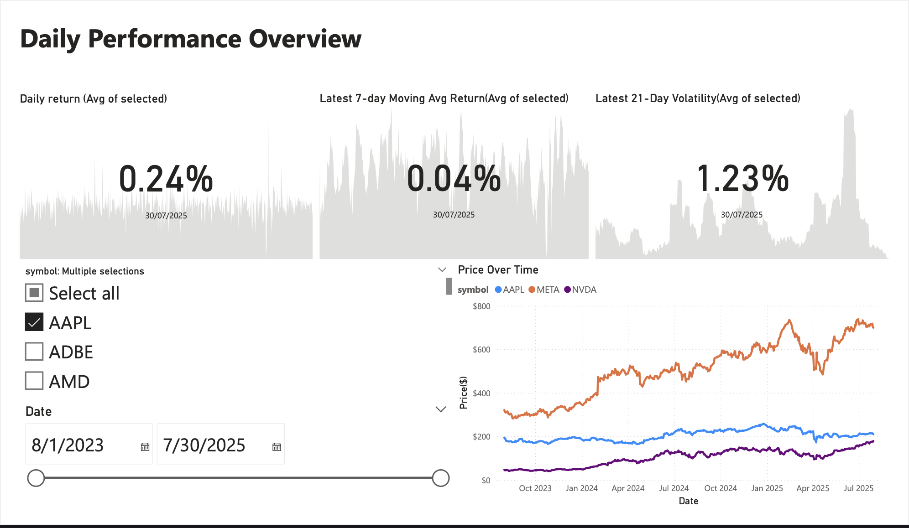
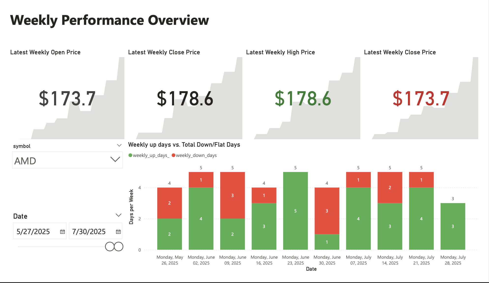
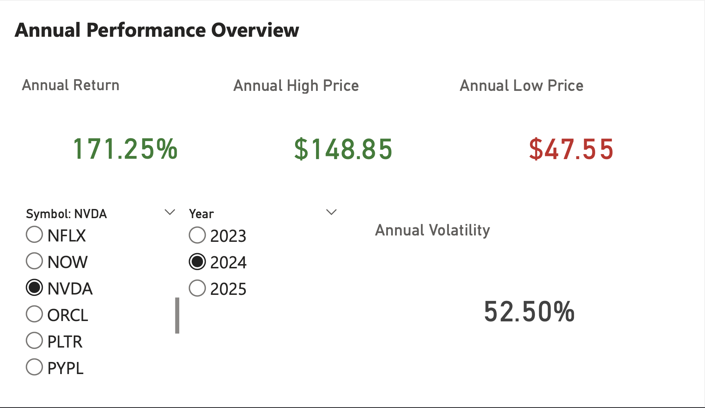

# Automated Stock Data Pipeline

A full-stack data pipeline that automates the process of collecting, transforming, storing, and visualizing stock market data using Docker, Python, SQL, and Power BI.

---

## Overview

This pipeline fetches stock data from Yahoo Finance, transforms it via a Python-based ETL process, stores it in a PostgreSQL database, and exposes analytical views for live connection to Power BI.

Built for modularity and experimentation, it allows analysts to plug in new metrics, automate reporting, and scale workflows with full transparency and reproducibility.

---

## Tech Stack

* **Docker & Docker Compose** – for isolated, reproducible environments
* **Python (`etl.py`)** – for fetching and transforming raw stock data
* **PostgreSQL** – for persistent storage and analytical queries
* **SQL** – for creating layered views (base, daily, weekly, annual)
* **Power BI** – for building dynamic dashboards

---

## Project Structure

```
.
├── docker-compose.yml
├── docker-compose.prod.yml
├── Dockerfile
├── etl.py
├── requirements.txt
├── scripts/
│   ├── entrypoint.sh
│   ├── healthcheck.sh
│   └── scheduler.sh
├── sql/
│   ├── create_table.sql
│   ├── upsert_stock_data.sql
│   ├── 1_base_view.sql
│   ├── 2_daily_metrics_view.sql
│   ├── 3_weekly_metrics_view.sql
│   ├── 4_annual_metrics_view.sql
│   ├── 5_reporting_view.sql
│   └── 6_reporting_weekly_view.sql
├── powerbi/
│   ├── dashboard.pdf
│   └── dashboard-page1.png
└── README.md
```

---

## How It Works

### Data Flow

1. **Yahoo Finance API**: Used to fetch historical stock data
2. **Python ETL (`etl.py`)**: Cleans and transforms data into structured format
3. **PostgreSQL**: Stores both raw and processed data
4. **SQL Views**: Create multiple layers of analytics-ready data
5. **Power BI**: Connects live to PostgreSQL for visualization

### Dockerized Setup

* `docker-compose.yml` runs:

  * A **PostgreSQL container** for storage
  * A **fetcher container** running the ETL script on a schedule

---

## Dashboard Preview




[Download Full Dashboard (PDF)](powerbi/stock_pipeline_dashboard.pdf)

---

## Future Work

* Add a sentiment analysis module to pull in job market data from APIs, job boards, or news sources
* Explore lagged correlations between job sentiment and sector-based stock returns
* Build predictive dashboards that blend sentiment shifts with momentum metrics

---

## Getting Started

1. Clone the repository
2. Create a `.env` file (see `.env.example` if provided)
3. Run the stack:

```bash
docker-compose up --build
```

4. Connect Power BI to your local PostgreSQL container using:

   * Host: `localhost`
   * Port: `5432`
   * DB: `<your_db_name>`
   * Username & password: from your `.env` file

---

## Contributions

Have an idea for expanding the pipeline, improving the analysis, or testing new signals? Open a pull request or drop a suggestion.

---

## Contact

For questions or feedback, feel free to connect with me on [LinkedIn](https://www.linkedin.com/in/mouizkisma)


